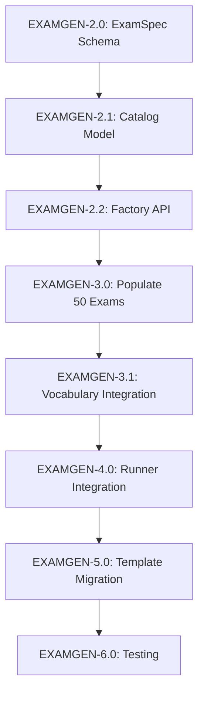

# EXAMGEN Work Package Index

**Last Updated:** 2025-01-18  
**Status:** Documentation Complete, Implementation Pending

## Quick Navigation

| Package | Title | Status | Dependencies | Est. Time |
|---------|-------|--------|--------------|-----------|
| [EXAMGEN-0.0](EXAMGEN-0.0-Overview.md) | Project Overview | Complete | None | N/A |
| [EXAMGEN-1.0](EXAMGEN-1.0-Current-Architecture.md) | Current Architecture Analysis | Complete | None | 2 days |
| [EXAMGEN-1.1](EXAMGEN-1.1-Root-Cause-Analysis.md) | Root Cause Analysis | Complete | EXAMGEN-1.0 | 1 day |
| [EXAMGEN-2.0](EXAMGEN-2.0-ExamSpec-Schema.md) | ExamSpec Schema Design | Not Started | EXAMGEN-1.1 | 3 days |
| [EXAMGEN-2.1](EXAMGEN-2.1-Catalog-Data-Model.md) | Catalog Data Model | Not Started | EXAMGEN-2.0 | 3 days |
| [EXAMGEN-2.2](EXAMGEN-2.2-Factory-API-Design.md) | Factory API Design | Not Started | EXAMGEN-2.1 | 2 days |
| [EXAMGEN-3.0](EXAMGEN-3.0-Initial-Catalog-Population.md) | Initial Catalog (50 exams) | Not Started | EXAMGEN-2.2 | 5 days |
| [EXAMGEN-3.1](EXAMGEN-3.1-Vocabulary-Integration.md) | Vocabulary Integration | Not Started | EXAMGEN-3.0 | 4 days |
| [EXAMGEN-4.0](EXAMGEN-4.0-SimulationRunner-Integration.md) | SimulationRunner Refactor | Not Started | EXAMGEN-3.1 | 5 days |
| [EXAMGEN-5.0](EXAMGEN-5.0-Template-Migration.md) | Template Migration | Not Started | EXAMGEN-4.0 | 4 days |
| [EXAMGEN-6.0](EXAMGEN-6.0-Validation-Testing.md) | Validation & Testing | Not Started | EXAMGEN-5.0 | 5 days |

## Implementation Phases

### Phase 1: Analysis & Design (EXAMGEN-1.x - 2.x)
**Duration:** 1-2 weeks  
**Goal:** Understand current system, design new architecture

- Document current data flows and failure modes
- Design ExamSpec schema with Pydantic validation
- Design catalog storage and query API
- Design factory pattern for exam selection

**Deliverables:**
- ExamSpec Python model with validators
- ExamCatalog class with index structures
- ExamFactory public API
- Architecture diagrams

### Phase 2: Catalog Population (EXAMGEN-3.x)
**Duration:** 1-2 weeks  
**Goal:** Create initial catalog with 50-100 high-quality exam definitions

- Create `app/catalog/exams.json` with 50 curated exams
- Download and integrate CPT, LOINC, RadLex vocabularies
- Curate 100 ICD-10 diagnosis codes for realistic indications
- Build vocabulary manager for code lookups

**Deliverables:**
- `app/catalog/exams.json` (50 ExamSpecs covering CT, MR, DX, US, MG, NM)
- `app/catalog/vocabulary/` with CPT, LOINC, RadLex, ICD-10 JSON files
- VocabularyManager class for unified access
- Validation script: `python -m app.catalog.validate`

### Phase 3: Integration (EXAMGEN-4.x - 5.x)
**Duration:** 2-3 weeks  
**Goal:** Refactor simulation runner and templates to use ExamSpec

- Refactor `handle_generate_hl7()` to use ExamFactory
- Refactor `handle_generate_dicom()` to require ExamSpec
- Remove random modality fallback logic
- Update `faker_parser.py` to use ExamSpec context
- Migrate existing simulation templates
- Update UI for exam selection

**Deliverables:**
- Refactored `simulation_runner.py` with validation guards
- New `dicom_generator.create_study_from_exam_spec()` function
- Updated faker functions using ExamSpec context
- Database migration script for SimulationStep model
- Updated frontend components for exam selection

### Phase 4: Testing & Validation (EXAMGEN-6.x)
**Duration:** 1-2 weeks  
**Goal:** Comprehensive test coverage and validation

- Unit tests for ExamSpec, Catalog, Factory (200+ tests)
- Integration tests for HL7/DICOM generation consistency
- E2E tests with 100-patient simulation
- Metadata validation checks (zero mismatches)
- Performance benchmarks (<100ms catalog load, <500ms DICOM gen)

**Deliverables:**
- `tests/` directory with 250+ tests
- GitHub Actions CI workflow
- Code coverage >80%
- Performance validation report
- Zero metadata mismatches in CI runs

## Critical Path



## Risk Matrix

| Risk | Likelihood | Impact | Mitigation |
|------|-----------|--------|------------|
| Vocabulary data unavailable | Low | High | Use manual curation if APIs fail |
| Template migration breaks existing sims | Medium | Medium | Maintain backwards compatibility for 3 months |
| Performance degradation | Low | Medium | Benchmark early, optimize if >500ms |
| PACS compatibility issues | Medium | High | Test with real PACS, validate against DICOM spec |
| User adoption resistance | Low | Low | Gradual rollout, maintain old templates during transition |

## Success Criteria

### Quantitative Metrics
- **Modality Mismatch Rate:** 0% (currently 18.7%)
- **Laterality Missing:** 0% (currently 41.2% when required)
- **Contrast Annotation:** 100% (currently 70.7%)
- **CPT Code Coverage:** 100% (currently 4.2%)
- **Multi-Series Studies:** 75%+ (currently 0%)
- **Test Coverage:** >80% for catalog and runner code
- **Performance:** <500ms DICOM generation per study

### Qualitative Goals
- Single source of truth for exam metadata
- Maintainable catalog (JSON, version control, validation)
- Extensible vocabulary integration (CPT, LOINC, RadLex)
- Realistic clinical workflows (ICD-10 indications, multi-series protocols)
- Developer-friendly API (factory pattern, clear errors)

## Timeline

### Optimistic (6 weeks)
- Week 1-2: Design + Schema (EXAMGEN-2.x)
- Week 3-4: Catalog + Vocab (EXAMGEN-3.x)
- Week 5: Integration (EXAMGEN-4.0)
- Week 6: Migration + Testing (EXAMGEN-5.0 + 6.0)

### Realistic (8 weeks)
- Week 1-2: Design + Schema
- Week 3-4: Catalog + Vocab
- Week 5-6: Integration + Debugging
- Week 7: Migration + UI Updates
- Week 8: Testing + Documentation

### Pessimistic (12 weeks)
- Week 1-3: Design + Schema (with vocabulary research)
- Week 4-6: Catalog + Vocab (manual curation if APIs fail)
- Week 7-9: Integration (with PACS compatibility fixes)
- Week 10-11: Migration + Testing
- Week 12: Bug fixes + Documentation

## Post-Implementation Tasks

### Maintenance (Ongoing)
- Add new exams to catalog as needed
- Update vocabulary mappings quarterly
- Review and adjust frequency weights based on real usage
- Monitor CI for metadata consistency failures

### Future Enhancements (Not in Scope)
- **EXAMGEN-9.0:** LLM-enhanced description generation (optional)
- **EXAMGEN-10.0:** User documentation and training
- Expand catalog to 200+ exams
- Add RadiologyInfo.org integration for patient education text
- Implement exam protocol templates (vendor-specific scanner settings)

## Related Documentation

- [Original Overhaul Doc](../exam-generation-overhaul.md) - Initial conversation capture
- [Copilot Instructions](../../.github/copilot-instructions.md) - Project context
- [Simulation Runner Code](../../app/util/simulation_runner.py) - Current implementation

## Getting Started

To begin implementation:

1. **Read Analysis Docs:** Review EXAMGEN-1.0 and EXAMGEN-1.1 for context
2. **Start with Schema:** Implement EXAMGEN-2.0 ExamSpec Pydantic model
3. **Build Catalog Loader:** Implement EXAMGEN-2.1 ExamCatalog class
4. **Populate Test Data:** Create minimal exams.json with 5-10 exams for testing
5. **Test Early:** Write unit tests as you go (EXAMGEN-6.0 guidance)

```bash
# Suggested first steps
cd /home/icculus/projects/yeeter

# Create directory structure
mkdir -p app/catalog/vocabulary
mkdir -p app/models
mkdir -p tests

# Start with ExamSpec model
touch app/models/exam_spec.py

# Create initial catalog
touch app/catalog/exams.json
touch app/catalog/__init__.py

# Start with tests
touch tests/test_exam_spec.py
```

## Contact & Questions

For questions about this work package structure:
- Review the detailed docs in each EXAMGEN-x.x file
- Check code comments in referenced files
- Refer to original conversation in `docs/exam-generation-overhaul.md`
